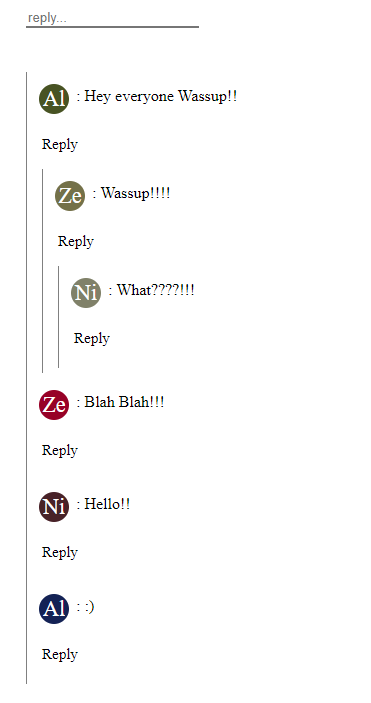

# nested-comments-react

This is a simple react library which supports Reddit like nested comments.

### Options:

#### Input Parameters:

- **data**: The initial set of comments to be loaded by the component

  - **Format**: `[{parent: Int, child: Int, comment: String, name: String}]`
    - **parent**: This is the parent Id of the comment. If the the comment is the root comment. Its parent Id can be any id as long as it is unique.
    - **child**: This is the actulal id associated with the comment and could be a parent to another comment.
    - **comment**: This is the comment string
    - **name**: Name of the user who commented.
  - **Eg:**:`[{parent: 10, child: 11, comment: "wassup!", name: "Dark Lord"}]`

- **userName**: Name of the logged in user. Through whose accouts the comments are being made

- **paginationSize**: The number of comments to be loaded on each click of the _show more_ button. Default value 2.

#### Output Parameters:

- **commentAdded**: This parameter accepts a callback function. Which is called each time a comment is added and gives the curent comment added along with bunch of other params as shown below.
  - **Format**: `{parent: Int, child: Int, comment: String, name: String}`
  - **Eg**: `{parent: 10, child: 11, comment: "wassup!", name: "Dark Lord"}`

### [Link to Example code](https://github.com/Alihussainladiwala/nestedComments/blob/main/nested-comments/src/stories/nestedComments.stories.js "Link to story")

### [Link to Repo](https://github.com/Alihussainladiwala/nestedComments "Link to repo")

Hey! If you found this library helpful make sure to start the repo...:)
